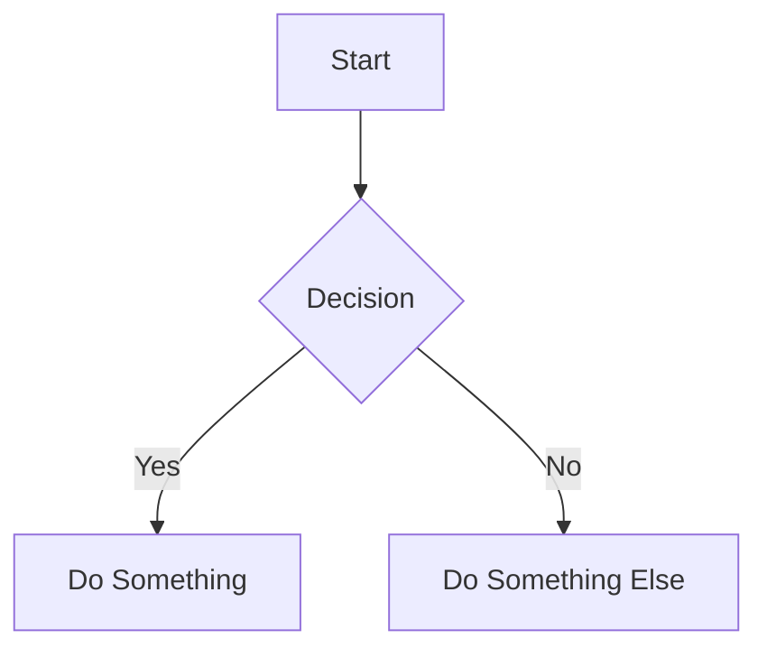

# Markdown Syntax Playground

This document demonstrates **most Markdown features**, including extended syntax, nested structures, and shortcodes (Hugo, JSX/MDX).

***

## 1. Headings

# H1

## H2

### H3

#### H4

##### H5

###### H6

***

## 2. Text Formatting

**Bold**_Italic**Bold + Italic**_~~Strikethrough~~`Inline code`

Subscript: H~~2~~O
Superscript: X^2^

***

## 3. Paragraph & Line Breaks

This is a paragraph.

This is another paragraph with a
line break.

***

## 4. Lists

### Unordered

* Item 1
  * Nested Item 1.1
    * Nested Item 1.1.1
* Item 2

### Ordered

1. First
2. Second
   1. Nested Second.1
   2. Nested Second.2

### Task List

* [x] Done
* [ ] Not Done

***

## 5. Links & Images

​[OpenAI](https://openai.com)​


Reference-style link:


***

## 6. Blockquotes

> This is a quote
>
> Nested quoteDeeply nested quote

***

## 7. Code Blocks

```js
function hello() {
  console.log("Hello, world!");
}
```

```python
def greet():
    print("Hello")
```

***

## 8. Tables

| Name  | Age | Role     |
| ----- | --- | -------- |
| Alice | 25  | Dev      |
| Bob   | 30  | Designer |

***

## 9. Horizontal Rule

***

***

***

***

## 10. Footnotes

Here is a footnote reference.

This is the footnote.

***

## 11. Definition List

Term 1
: Definition 1

Term 2
: Definition 2

***

## 12. Emoji

😀 🚀 🔥

***

## 13. HTML in Markdown

<div style="color:red">
  This is raw HTML inside Markdown.
</div>

***

## 14. Nested Complex Example

* Item A
  1. Ordered inside unordered
     * Code block inside list:

```bash
echo "Nested!"
```

* Blockquote inside list:

> Nested quote inside list

***

## 15. Collapsible Section (HTML)

<details>
<summary>Click to expand</summary>

Hidden **Markdown** content inside.

</details>

***

## 16. Hugo Shortcodes

### YouTube



### Figure



### Highlight


fmt.Println("Hello Hugo")


***

## 17. MDX / JSX Components

import \{ Button } from './Button'

<Button onClick>
alert('Clicked!')}>
Click Me
</Button>

### Props Example

<MyComponent title="Hello" count="3">
<p>Children content</p>
</MyComponent>

***

## 18. Admonitions (Extended Markdown)

> \[!NOTE]
> This is a note

> \[!WARNING]
> This is a warning

> \[!TIP]
> This is a tip

***

## 19. Math (LaTeX)

Inline: $E = mc^2$​

Block:

$$
\int_0^1 x^2 dx
$$

***

## 20. Mermaid Diagram



***

## 21. YAML Frontmatter (Hugo/Jekyll)

```yaml
---
title: "Markdown Playground"
date: 2026-01-01
draft: false
tags: [markdown, demo]
---
```

***

## 22. Nested Everything Combo

> Quote with list:
>
>

***

## 23. Escaping Characters

_Not italic_

# Not a heading

***

## 24. Keyboard Input

Press <kbd>Ctrl</kbd> + <kbd>C</kbd>​

***

## 25. Abbreviations

\*\[HTML]: Hyper Text Markup Language

HTML is cool.

***

## Done 🎉

This file includes:

* Core Markdown
* Extended Markdown
* HTML
* Hugo shortcodes
* MDX/JSX
* Nested structures

Use it as a **reference or playground**.
